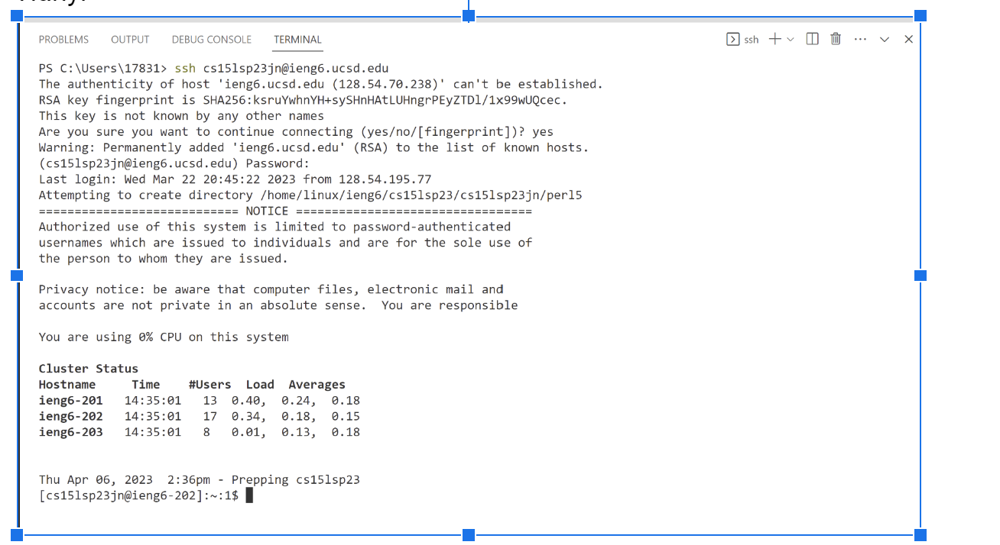
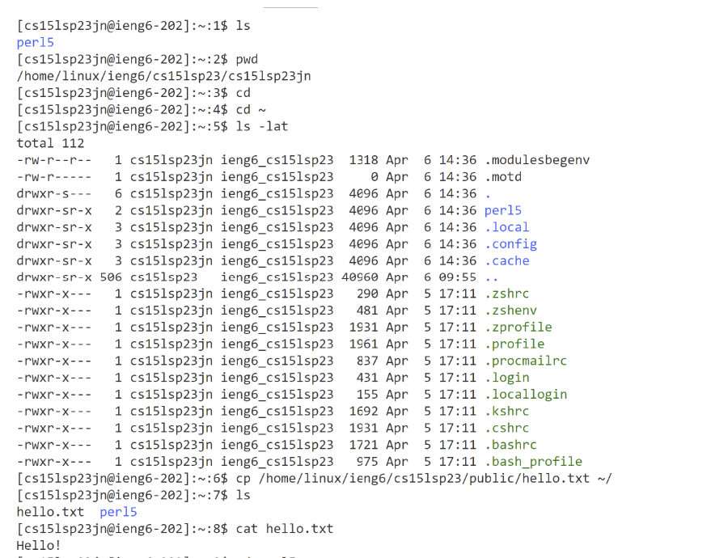

# 1. Installing VScode.  
 - First in goole type "VS code download" or use this [Link](https://code.visualstudio.com/download).   
 - It shall take you to this page.  

 - According to the operating system you used, click on the accroding button for download. 
 
# 2. Connecting to SSH.  
 - First find your account number by going to [Link](https://sdacs.ucsd.edu/~icc/index.php)  
 - If using Windows, first download git so you can use ssh. [Link](https://gitforwindows.org/).
 - Using bash on windows using vs code [Link](https://stackoverflow.com/questions/42606837/how-do-i-use-bash-on-windows-from-the-visual-studio-code-integrated-terminal/50527994#50527994).  
 - Open the VS code terminal.  
 - type  "ssh cs15lsp23zz@ieng6.ucsd.edu" with zz replaced by your account specific number.   
 - You can find your course specific number from this [Link](https://sdacs.ucsd.edu/~icc/index.php).   
 - You shall observe this page. 

 - You are expecting to see the cluster status. The status is different by different person because it tells us the status of the cluster when I connected to it. And the status varies as the number of students connected to the cluster changes over time. 

# 3. Trying some commands.   
 - The result of some of the commands are listed here  

 - Ls-l list files with permissions
 - Ls-a shows hidden files
 - Ls-t shows files arranged by time
 - pwd prints the working directory
 - ~ is the root directory
 - cd changes the directory
 - cat show the content of the file
