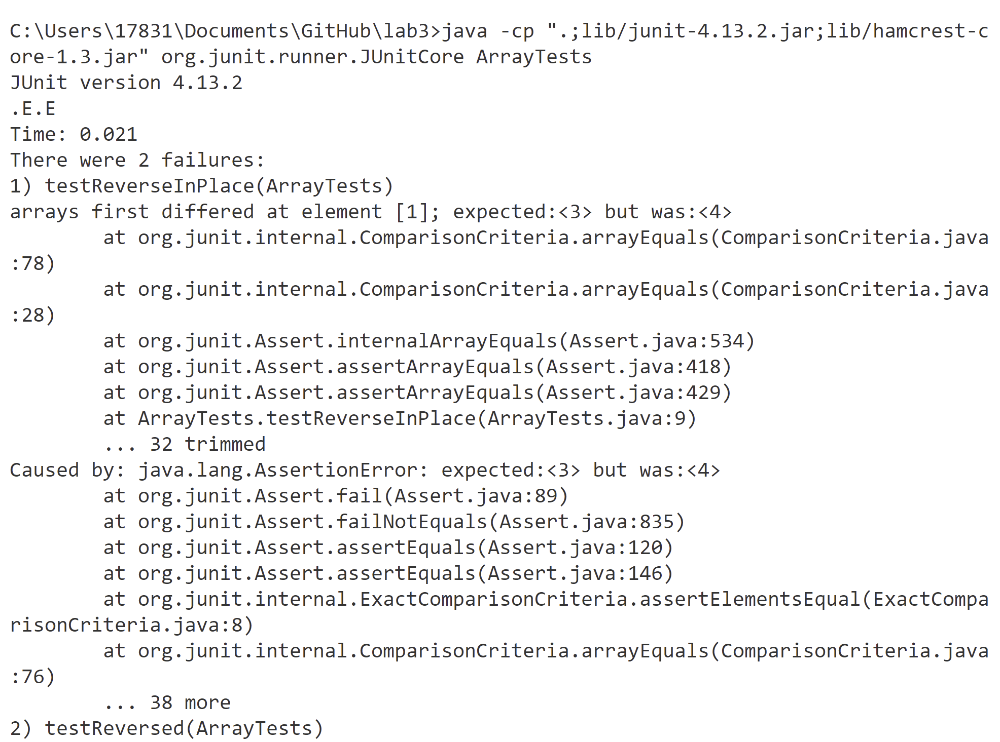

# 1. Write a web server called StringServer that prints out messages according to a string input to the URL. <br />
 - The code to accomplish this task. <br /> 


 - For my code, the handle request method has been called, which detect the string after the equal sign, and retrn a new line of containing that string.<br />
 - The screen shots of my code running in the web server. <br />
 
 
 - The value line changes , adding one line of my name is Tianyi, and one line of want to sleep. <br />
 - (I made a mistake typing my name for two times, hence the second screenshot has two line updated.) <br />
 - The value url changes with regard to each different input.<br />
 - The value parameter also changes each time.<br />
# 2. Explore buggy behavior including finding failure inducing input, writing test ,recording symptom and bug fixes. <br />
 - The code blocks of the junit test inducing failture. <br /> 
``` java
public void testReversed() {
    int[] input1 = {2,3,4};
    assertArrayEquals(new int[]{ 4,3,2}, ArrayExamples.reversed(input1));
  }
```
 - The code blocks of the junit test doesn't induce  failture. <br />
``` java
public void testReverseInPlace() {
    int[] input1 = { 3,4 };
    ArrayExamples.reverseInPlace(input1);
    assertArrayEquals(new int[]{ 4,3 }, input1);
	}
```
- The symptom of running the  junit test. <br /> 

- The bug and bug fixes . <br />
``` java
static int[] reversed(int[] arr) {
    int[] newArray = new int[arr.length];
    for(int i = 0; i < arr.length; i += 1) {
      arr[i] = newArray[arr.length - i - 1];
    }
    return arr;
  }
```
The fixed code . <br />
``` java
static int[] reversed(int[] arr) {
    int[] newArray = new int[arr.length];
    for(int i = 0; i < arr.length; i += 1) {
      newArray[arr.length - i - 1]=arr[i];
    }
    return newArray;
  }
```
- The problem with the bug is that the newArray is empty, and we are trying to set the old array according to value of the new array.<br />
We just need to fill the new array with the element of the old array and the reversed array would work.<br />
# 3. Reflections. <br />
- It's really fascinating to connect and run a remote server on the computers in the lab. <br /> 
- Being able to run the server from non-protected ucsd network also makes it cool, as I can access a remote computer while at home.<br /> 
- For bug fixes, I believe i have a deeper understanding of testcases, and why sometimes it won't fail.<br /> 


 

