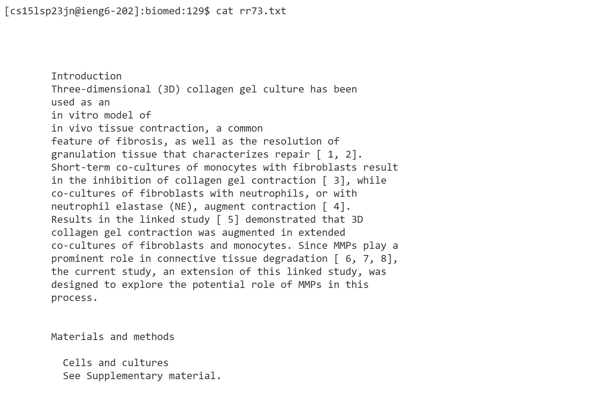
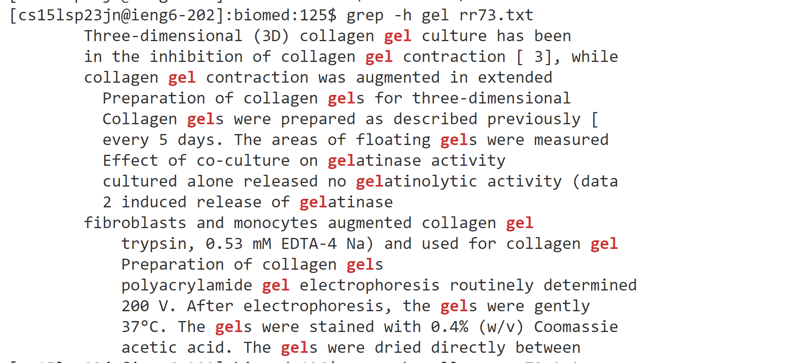
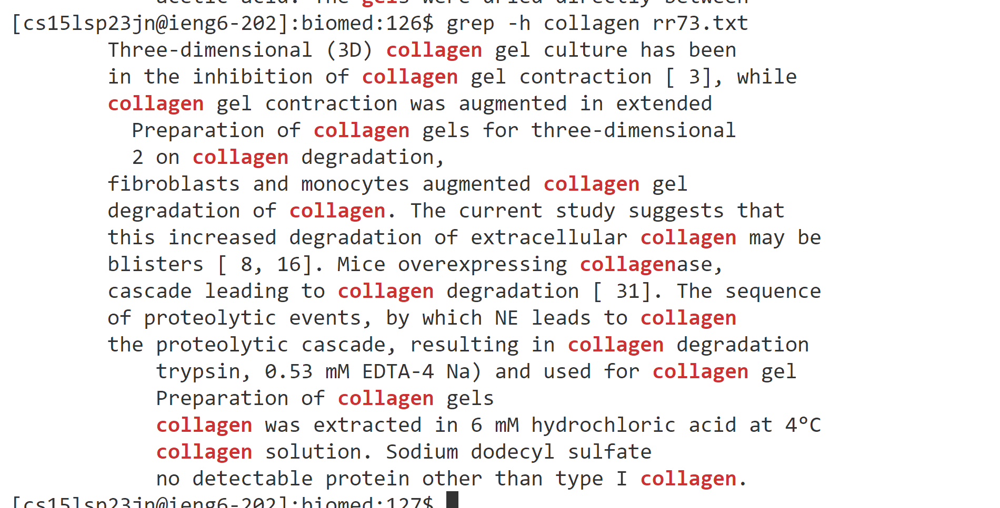
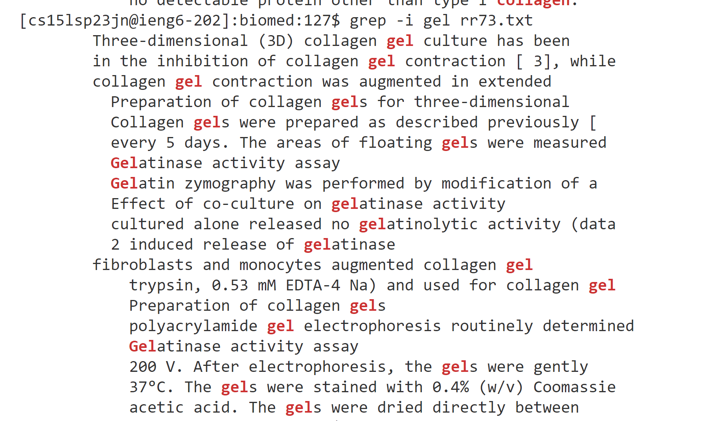
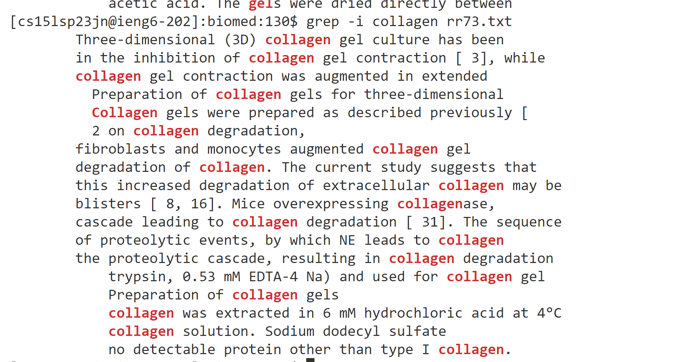

# 1. Researching Commands Focusing on Grep <br />
- I am tring to explore 4 different options of Grep. <br />  
- After web research here are a few options I found.
  - grep -c This prints only a count of the lines that match a pattern
  - grep -h Match whole word, suppress the printing of the filename,\
  - grep -i Ignores case for matching
  - grep -l Displays list of a filenames only
- Lets try it on a specific file from the tehcnical folder
- We use the grip command on a file in the biomed sub-folder named rr73, which talks about hydrogel.
- Command we use to get that folder and display some contents
```
cd ~/docsearch/technical/biomed/
cat rr73.txt
```
-  partial result of cat command (It is quite long, so hard to include all contents, but looks like its about collagen gel.)<br />
 
-  Lets use grep-c to find counts of lines related to the word gel, or collagen
```
grep -c gel rr73.txt
grep -c collagen rr73.txt
```
 - The result looks reasonable <br />  
 
-  Lets use grep -h to find lines mathes to the whole word gel, or collagen while supressing printing the file name.
 
```
grep -h gel rr73.txt
grep -h collagen rr73.txt
```



-  Lets use grep -i to find lines mathes to the word gel, or collagen that is case insensitive.
-  The results are expected, showing Gel and gel.<br /> 



-  Lets use grep -l to find filenames only
```
grep -h gel rr73.txt
grep -h collagen rr73.txt
```
- the result are just printing file names.<br /> 

- What if the file doesn't have the word?
```
grep -h feadsfasdf rr73.txt
```
It won't return anything. <br /> 


